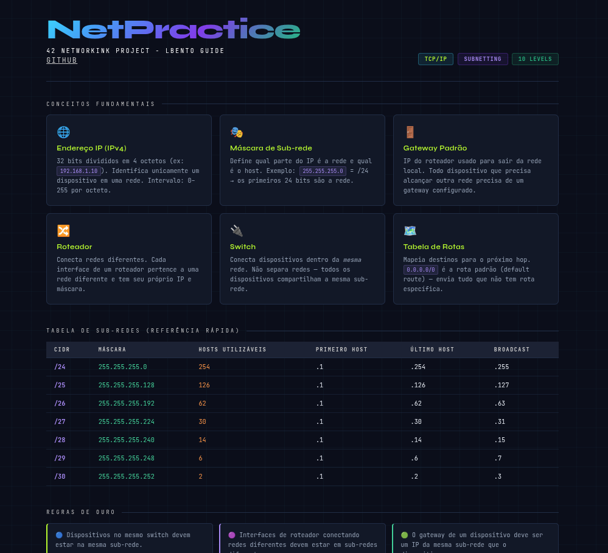

# NetPractice — 42 School Project

*This project has been created as part of the 42 curriculum by lbento.*

---

## Description

**NetPractice** is a practical exercise designed to introduce the fundamentals of computer networking. Through 10 progressive levels, you will configure IP addresses, connect devices through routers, and understand how data travels across networks.

The goal is to fix broken network diagrams so that all devices can communicate correctly. Each level presents a non-functioning network configuration, and your job is to fill in the missing values (IP addresses, subnet masks, gateways) until the network works.

> ⚠️ The networks in this project are simulated — they are not real networks.

---

## Instructions

### How to run the training interface

1. Download the project files from the 42 intranet project page.
2. Extract the downloaded archive into any folder on your machine.
3. Open the `index.html` file in your web browser (no server needed).
4. The **NetPractice** interface will load in your browser.

### Using the interface

- **Enter your login** in the input field to use your personalized configuration. This is **mandatory** for submission.
- Use the **"Practice"** tab (with your login) during training.
- Use the **"Evaluation"** tab for a random configuration — the same format used during peer defense.

### Solving a level

1. Read the **goal(s)** displayed at the top of the screen.
2. Modify the **unshaded fields** (the editable ones — IPs, masks, gateways, routes).
3. Click **[Check again]** to verify your configuration.
4. Read the **logs at the bottom** of the page to diagnose any issues (missing gateway, invalid IP, wrong subnet, etc.).
5. Once the level is complete, a new button will appear — click it to advance.

### Exporting your configuration

Before moving to the next level, **always click [Get my config]** to download your configuration file. This is the file you will submit.

### Submission requirements

- You must complete and export **10 configuration files** (one per level).
- Place all 10 files at the **root of your Git repository**.
- Make sure your **login is entered** in the interface before exporting — it must appear in the filename/config.
- During the defense, you will have to solve **3 random levels**, with a 15 minuts limit.
- External tools are **not allowed** during evaluation (only `bc` calculator is tolerated).

---

## Networking Concepts Studied

To complete NetPractice, you must understand the following concepts:

### TCP/IP Addressing
The addressing system used on the internet and most local networks. Every device gets an IP address that uniquely identifies it on a network.

### IPv4 Address Structure
An IPv4 address is 32 bits long, written as four octets (e.g., `192.168.1.1`). Each octet ranges from 0 to 255.

### Subnet Mask
A subnet mask defines which portion of an IP address identifies the **network** and which identifies the **host**. Example: `255.255.255.0` (or `/24`) means the first 24 bits are the network part.

| CIDR | Subnet Mask     | Hosts per subnet |
|------|-----------------|-----------------|
| /24  | 255.255.255.0   | 254             |
| /25  | 255.255.255.128 | 126             |
| /26  | 255.255.255.192 | 62              |
| /27  | 255.255.255.224 | 30              |
| /28  | 255.255.255.240 | 14              |
| /30  | 255.255.255.252 | 2               |

### Network Address & Broadcast
- The **first address** of a subnet is the **network address** (not assignable to hosts).
- The **last address** is the **broadcast address** (not assignable to hosts).
- Usable host addresses are everything in between.

### Default Gateway
The IP address of the router interface that a device uses to send packets to destinations outside its own network. Every device that needs to reach another network must have a gateway configured.

### Routers
Devices that forward packets between different networks. Each router interface belongs to a different network and has its own IP address.

### Switches
Devices that connect multiple devices within the **same network** (same subnet). Unlike routers, switches do not separate networks — all ports share the same network address.

### Routing Table
A table in a router or host that maps destination networks to the next hop (gateway). The special route `0.0.0.0/0` is the **default route** — it matches any destination not matched by more specific routes.

### OSI Model (reference)
The 7-layer model that describes how data moves through a network:
1. Physical
2. Data Link
3. **Network** ← IP addressing lives here
4. Transport
5. Session
6. Presentation
7. Application

## Resources

### Official & Documentation
- [RFC 791 — Internet Protocol](https://datatracker.ietf.org/doc/html/rfc791)
- [Cisco Networking Basics](https://www.cisco.com/c/en/us/solutions/small-business/resource-center/networking/networking-basics.html)
- [Subnet Calculator](https://www.subnet-calculator.com/)
- [CIDR to Subnet Mask Reference](https://cidr.xyz/)

### Tutorials & Guides
- [How Subnetting Works — Practical Networking](https://www.practicalnetworking.net/stand-alone/subnetting-mastery/)
- [TCP/IP Guide (free online book)](http://www.tcpipguide.com/free/index.htm)
- [NetPractice Cheat Sheet — common community notes](https://github.com/lpaube/NetPractice)

---

## My guide

Here is a quick visual guide I made while studying NetPractice.

**To see the guide just open the `net_practice_guide.html` file in your web browser (no server needed).**

## Quick Reference: Rules to solve levels

1. **Devices on the same switch must be on the same subnet.**
2. **Two router interfaces connecting two networks must be on different subnets.**
3. **Every device that communicates outside its subnet needs a gateway.**
4. **The gateway must be an IP on the same subnet as the device.**
5. **Routing tables: `0.0.0.0/0` as destination = default route (send everything here).**
6. **Never assign the network address or broadcast address to a device.**
7. **A router routes between networks — its interfaces are in different subnets.**

## Solutions

Here are all the solutions for all 10 Levels.

### Level 6

  
show

  
  

### Level 7

  
show

  
  

### Level 8

  
show

  
  

### Level 9

  
show

  
  

### Level 10

  
show

  
  

